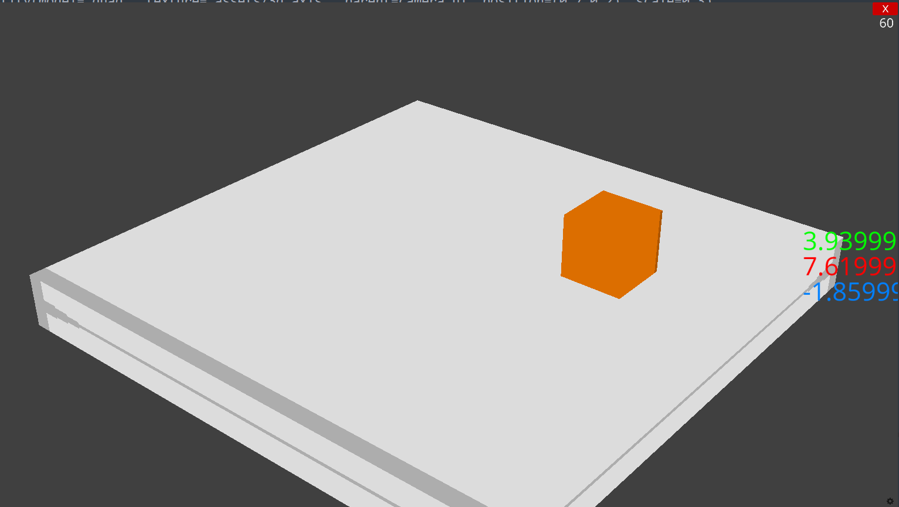

# Position Editor For Ursina
An open source use and throw 😄 position editor for 3D games made with Ursina Engine

=> Step 1:
  Copy and paste the code from *editor.py*
    
=> Step 2:
 Edit the speed and target entity(the entity whose position you want to edit) 
 
=> Step 3:
  Get the required position of the object and update it manually in your code

DONE!!

